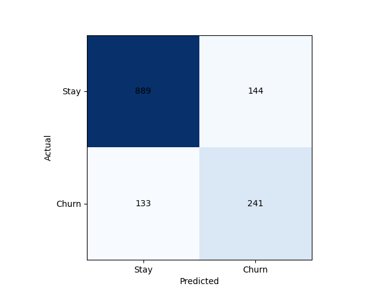
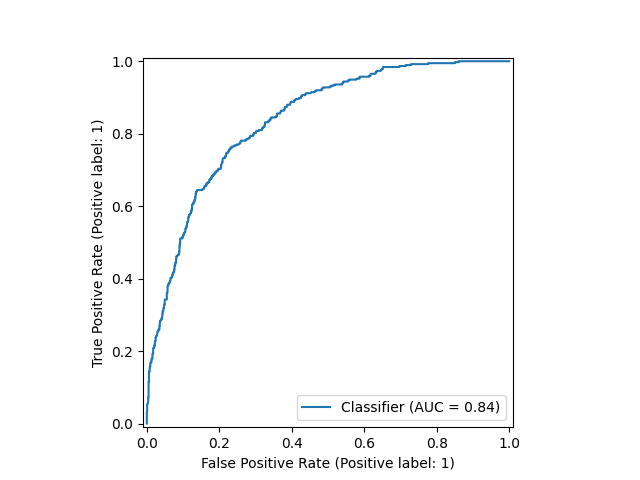

# Gradient Boosting Churn Model Report

**Test ROC AUC:** 0.8386  
**Test F1 (@thr=0.42):** 0.635

## Classification Report  
              precision    recall  f1-score   support

           0       0.87      0.86      0.87      1033
           1       0.63      0.64      0.64       374

    accuracy                           0.80      1407
   macro avg       0.75      0.75      0.75      1407
weighted avg       0.81      0.80      0.80      1407

scss
Copy
Edit

 
